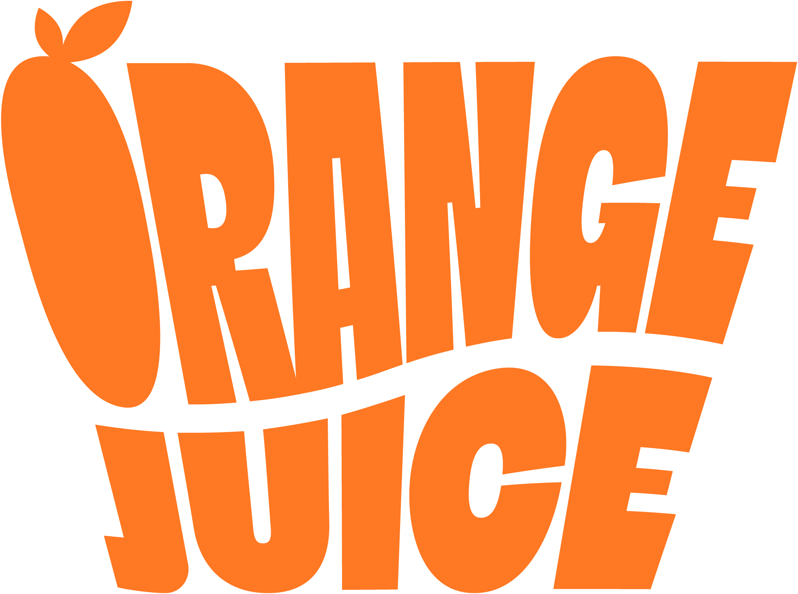

<h1 width="100%"  align="center">Orange Juice Social</h1>
<h3 width="100%"  align="center"> 
  
</h3>

## Projeto de Conclusão do Bacharelado em Sistemas de Informação na Unoeste

**Aluno**: [Guilherme Camargo Gonzalez](https://github.com/GuilhermeGonzalez) </br>
**Orientador**: [Dione Ferrari](https://www.linkedin.com/in/dione-ferrari-a9362b93/) </br>
**Responsável empresa**: [Joel Backschat](https://www.linkedin.com/in/joel-backschat-2a027b2a/) </br>

### Escopo
O software Orange Juice Social é um sistema web feito com o intuito de atender
as necessidades que os novos integrantes na empresa possuem, visando
aumentar o engajamento e trazer cada vez mais a cultura da empresa para este
novo colaborador.</br>
A utilização deste software fará com que os novos sangues laranjas se sintam
acolhidos na empresa, e também promovendo mais a cultura que temos de se
tornar o protagonista de sua própria história, sendo assim ajudando este
colaborador a crescer profissionalmente e tornando a empresa em um ambiente
cheio de profissionais de alta qualidade/performance e bem engajados no
mercado.

### A Solução
Foi criado uma plataforma web onde sera disponibilizado o acesso para o colaborador apos o cadastro de um administrador, sendo assim o colaborador sera comunicado deste novo acesso e ao entrar na plataforma ele poderá começar a usar todas as suas funcionalidades, tais como as trilhas de estudos, quizzes, desafios e noticias mais recentes da empresa. Todos os eventos e comunicações ficarão disponíveis na home para que ele tenha um facil acesso e controle.

<hr/>

#### Link utéis
##### [Aplicação no Heroku](https://orange-juice-social-frontend.herokuapp.com)
##### [Video explicando o projeto](https://youtu.be/VGPHE_CCFJA)

<hr/>


##### Clonar o repositório
```
git clone https://github.com/guigonzalezz/orange-juice-social-frontend.git
```
##### Baixar as dependências
###### Navegue até o diretório e baixe as dependências:
```
cd orange-juice-social-frontend
yarn
```

##### Adicione as variáveis de ambiente
###### Encontre o arquivo .env e realize a alteração:
```
...
```

##### Execute o programa
###### Inicializando o projeto:
```
yarn dev
```

<hr/>

#### Bibliotecas e frameworks utilizadas
- Reactjs
- NextJS
- MaterialUI
- Yup e Formik
- JSPdf

<hr/>


#### Feedback

Feedback é sempre bem-vindo, se você tiver qualquer sugestão ou duvida por favor me enviar um e-mail: gcgonzalez99@hotmail.com

<h3 align="center" width='100%'>
    
    
</h3>

